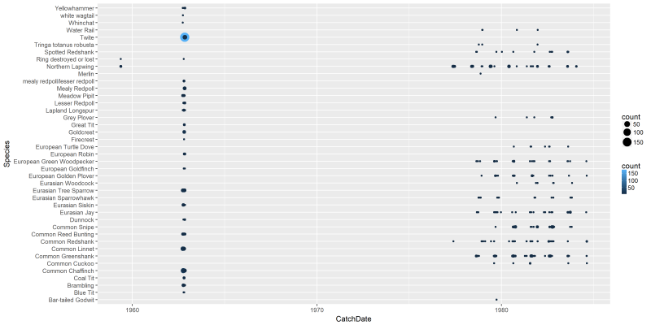
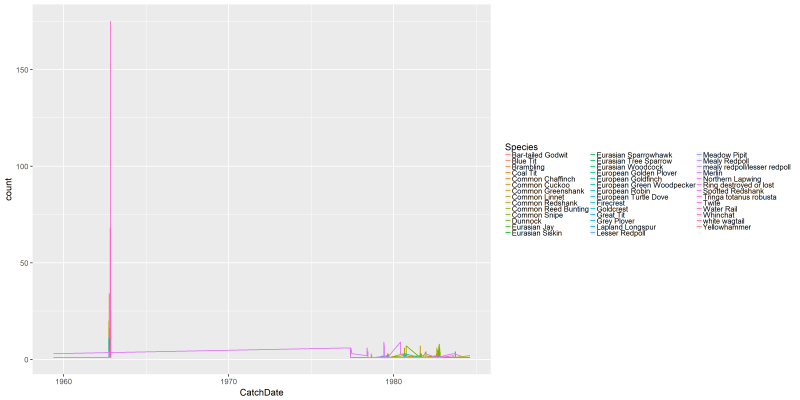
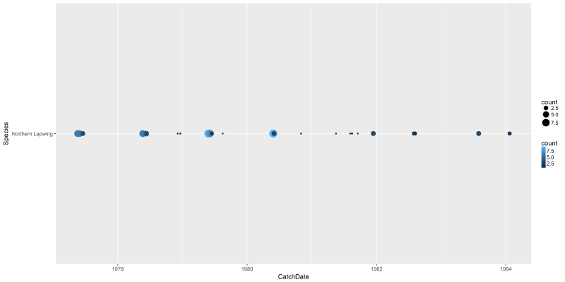
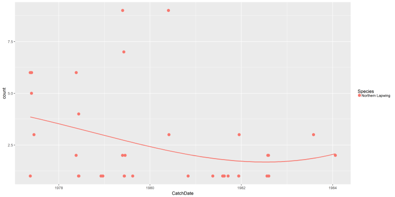
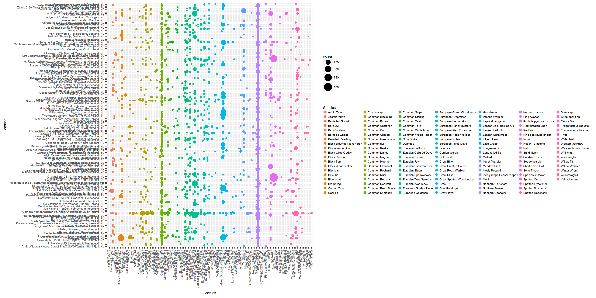
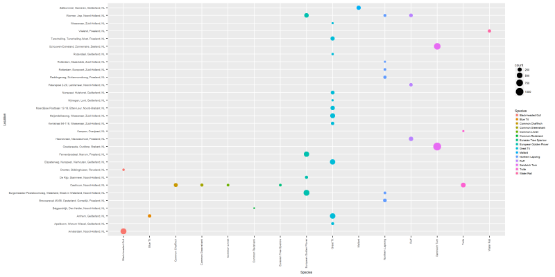
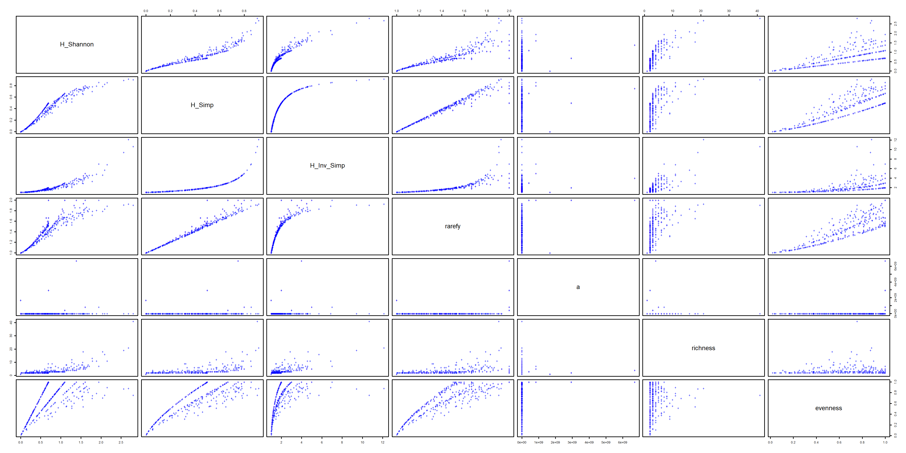

# R for Reproducible Scientific Analysis (Jupyter)

In this session we assume that there is a basic knowledge of R and it's syntax. There is also a parallel session running on [Data Carpentry for Ecology](https://nioo.knaw.nl/en/open-science-tools) that provides an in-depth presentation of R. The material presented here is based on the following lessons:
- [Software Carpentry: Programming with R](http://swcarpentry.github.io/r-novice-inflammation/)
- [Software Carpentry: R for Reproducible Scientific Analysis](http://swcarpentry.github.io/r-novice-gapminder/)
- [Data Carpentry: R for data analysis and visualization of Ecological Data](http://www.datacarpentry.org/R-ecology-lesson/)

## Data

We will use our new Jupyter environment to analyze the [bird ringing data Netherlands 1960-1990 part 1, led by  Henk van der Jeugd](https://doi.org/10.17026/dans-2ch-6s6r). The `csv` file containing this data available though this workshop is [here](https://github.com/fpsom/reproducible-analysis-workshop/raw/master/files/Export_DANS_Parels_van_Datasets_Vogeltrekstation.csv), and the original source is [here](https://easy.dans.knaw.nl/ui/datasets/id/easy-dataset:63027).


## Code and document

Let's try and have an general analysis of the data we downloaded earlier. First, we'll need to import some libraries that will help us with the analysis process.

```
# Data Analysis Libraries
library(dplyr)
library(tidyr)

# [Community Ecology Package](https://cran.r-project.org/web/packages/vegan/index.html)
library(vegan)

# Visualization Libraries
library(ggplot2)
```

# Loading and Cleaning Data

For our first step, we will load the data and then view the top records as well as a summary of all variables included.

```
dansDataSet <- read.csv(file = "Export_DANS_Parels_van_Datasets_Vogeltrekstation.csv", header = TRUE)

head(dansDataSet)
summary(dansDataSet)
```

We observe that even though the data was loaded correctly, they are not used in the best possible way. For example, `Ringnumber`, `CatchDate` and `Age` are used as words rather than as numeric values. Also, missing values are defined as `NULL` which is not recognized as such by R (the correct value would be `NA`). The next block tidies the data, so that that each attribute is treated as originally intended.


```
dansDataSet <- data.frame(lapply(dansDataSet, function(x) { gsub("NULL", NA, x) }))

dansDataSet$Ringnumber <- as.numeric(dansDataSet$Ringnumber)
dansDataSet$CatchDate <- as.Date(dansDataSet$CatchDate)
dansDataSet$Age <- as.numeric(dansDataSet$Age)
dansDataSet$Broodsize <- as.numeric(dansDataSet$Broodsize)
dansDataSet$PullusAge <- as.numeric(dansDataSet$PullusAge)
dansDataSet$CatchDate <- as.Date(dansDataSet$CatchDate)

head(dansDataSet)
summary(dansDataSet)
```

We can see that the data is much more better formatted and useful for further analysis.

# Subsetting our data

Let's now create a few subsets of the original data. Subset #1 `dansDataSet_Castricum` will contain all the unique records for which `Location` is `Castricum, Noord-Holland, NL`. Then we will group the records by species and catch date, and calculate number of each species in the particular catch date.

```
dansDataSet_Castricum <- dansDataSet %>%
  filter(Location == "Castricum, Noord-Holland, NL") %>%
  select(unique.RingID = RingID, Species, CatchDate) %>%
  group_by(Species, CatchDate) %>%
  summarise(count = n())
```

We could further filter this subset for a particular species. For example, the code below will retrieve all unique observations of Northern Lapwing in Castricum, Noord-Holland, NL.

```
dansDataSet_lapwing <- dansDataSet %>%
  filter(Location == "Castricum, Noord-Holland, NL") %>%
  select(unique.RingID = RingID, Species, CatchDate) %>%
  group_by(Species, CatchDate) %>%
  filter(as.POSIXct(CatchDate) >= as.POSIXct("1970-01-01 00:00:01")) %>%
  filter(Species == "Northern Lapwing") %>%
  summarise(count = n())
```

Our second subset will create a matrix of the distribution of unique species across the different locations. This will consequently allow us to calculate some diversity indexes.

```
dansDataSet_distribution <- dansDataSet %>%
  select(unique.RingID = RingID, Species, Location) %>%
  group_by(Species, Location) %>%
  summarise(count = n()) %>%
  filter(count > 0) %>%
  na.omit()

# spread(data, key, value)
#   data: A data frame
#   key: The (unquoted) name of the column whose values will be used as column headings.
#   value:The (unquoted) names of the column whose values will populate the cells
dansDataSet_distribution_matrix <- dansDataSet_distribution %>%
  spread(Location, count)
```

We can also create a more specific subset, i.e. of species that have at least 100 unique observations in a given location. This will allow for a cleaner figure.

```
dansDataSet_distribution_min100 <- dansDataSet %>%
  select(unique.RingID = RingID, Species, Location) %>%
  group_by(Species, Location) %>%
  summarise(count = n()) %>%
  filter(count > 100) %>%
  na.omit()
```


# Using the `vegan` package

We will now use the [`vegan`](https://cran.r-project.org/web/packages/vegan/index.html) package to calculate the diversity in the locations.

## Transforming the data to `vegan` requirements

```
dansDataSet_distribution_zero <- dansDataSet_distribution_matrix
dansDataSet_distribution_zero[is.na(dansDataSet_distribution_zero)] <- 0
dansDataSet_distribution_zero <- t(dansDataSet_distribution_zero[,2:length(dansDataSet_distribution_zero)])

```

## Calculating diversity: **Shannon**, **Simpson** and **Inverted Simpson**.

For each of these indexes, we are going to call the corresponding function from vegan, using the default parameters:

Shannon or Shannon–Weaver (or Shannon–Wiener) index is defined as:

$$H = -\sum_{n=1}^{R} p_i ln_b(p_i) = 1$$

where $p_i$ is the proportional abundance of species $i$ and $b$ is the base of the logarithm. It is most popular to use natural logarithms, but some argue for base $b = 2$.

Both variants of Simpson's index are based on $D = \sum_{n=1}^{R}p_i^2$. Choice simpson returns $1-D$ and invsimpson returns $\frac{1}{D}$.

```
Hshannon <- diversity(dansDataSet_distribution_zero, index = "shannon", MARGIN = 1, base = exp(1))
simp <- diversity(dansDataSet_distribution_zero, "simpson", MARGIN = 1)
invsimp <- diversity(dansDataSet_distribution_zero, "inv", MARGIN = 1)
```


## Calculating species richness

The function `rarefy` gives the expected species richness in random subsamples of size sample from the community. The size of sample should be smaller than total community size, but the function will silently work for larger sample as well and return non-rarefied species richness (and standard error equal to 0). If sample is a vector, `rarefaction` is performed for each sample size separately. Rarefaction can be performed only with genuine counts of individuals. The function rarefy is based on Hurlbert's (1971) formulation, and the standard errors on Heck et al. (1975).

```
r.2 <- rarefy(dansDataSet_distribution_zero, 2)
```

## Calculating `fisher.alpha`

This function estimates the $a$ parameter of Fisher's logarithmic series. The estimation is possible only for genuine counts of individuals. The function can optionally return standard errors of $a$. These should be regarded only as rough indicators of the accuracy: the confidence limits of $a$ are strongly non-symmetric and the standard errors cannot be used in Normal inference.

```
alpha <- fisher.alpha(dansDataSet_distribution_zero)
```

## Richness and Evenness

Species **richness** (S) is calculated by `specnumber` which finds the number of species. If MARGIN is set to 2, it finds frequencies of species. **Pielou's evenness** (J) is calculated by $\frac{H_shannon}{log(S)}$.

```
S <- specnumber(dansDataSet_distribution_zero, MARGIN = 1) ## rowSums(BCI > 0) does the same...
J <- Hshannon/log(S)
```

In order to have all these indeces together, we will put them in a single data frame as follows:

```
metrics <- data.frame(
  H_Shannon = Hshannon,
  H_Simp = simp,
  H_Inv_Simp = invsimp,
  rarefy = r.2,
  a = alpha,
  richness = S,
  evenness = J
)
```


# Results

Finally, let's also create some plots. First of all, let's create a plot based on our first subset, showing for each species and capture dates, the average age of the species captured.

```

png("files/figs/subset1a1.png", width = 4000, height = 2000, res = 300, pointsize = 5)
ggplot(data=dansDataSet_Castricum, aes(x=CatchDate, y=Species, color=count)) +
  geom_point(aes(size=count))
dev.off()
```



```
png("files/figs/subset1a2.png", width = 4000, height = 2000, res = 300, pointsize = 5)
ggplot(data=dansDataSet_Castricum, aes(x=CatchDate, y=count, colour=Species)) +
  geom_line()
dev.off()
```


We can do the same plots for the single species that we looked into earlier (Northern Lapwing in Castricum, Noord-Holland, NL).

```
png("files/figs/subset1b1.png", width = 4000, height = 2000, res = 300, pointsize = 5)
ggplot(data=dansDataSet_lapwing, aes(x=CatchDate, y=Species, color=count)) +
  geom_point(aes(size=count))
dev.off()
```


This is not really easy to interpret. However, we can now have a more interesting plot with the `lines` command, including a smoothing curve to show the overall trend:

```
png("files/figs/subset1b2.png", width = 4000, height = 2000, res = 300, pointsize = 5)
ggplot(data=dansDataSet_lapwing, aes(x=CatchDate, y=count, colour=Species)) +
  geom_point(aes(x = CatchDate, y = count, colour = Species), size = 3) +
  stat_smooth(aes(x = CatchDate, y = count), method = "lm", formula = y ~ poly(x, 3), se = FALSE)
dev.off()
```



We can also create a plot based on the second subset. In this case, let's see how the distribution of species across the seven locations looks like.

```
lvls <- unique(as.vector(dansDataSet_distribution$Location))
png("files/figs/subset2a.png", width = 4000, height = 2000, res = 300, pointsize = 5)
ggplot(data=dansDataSet_distribution, aes(x=Species, y=Location, color=Species)) +
  geom_point(aes(size=count)) +
  theme(text=element_text(family="Arial", size=12*(81/169)),
        axis.text.x = element_text(angle = 90, hjust = 1, vjust=0.3)) +
    scale_y_discrete(breaks=lvls[seq(1,length(lvls),by=10)]) #scale_y_discrete(labels = abbreviate)
dev.off()
```


This is a very "dense" figure, so let's use the filtered version to see the most highly populated species.


```
png("files/figs/subset2b.png", width = 4000, height = 2000, res = 300, pointsize = 5)
ggplot(data=dansDataSet_distribution_min100, aes(x=Species, y=Location, color=Species)) +
  geom_point(aes(size=count)) +
  theme(text=element_text(family="Arial", size=12*(81/169)),
        axis.text.x = element_text(angle = 90, hjust = 1, vjust=0.3))
dev.off()
```



Finally, let's have a figure showing all 5 indexes together.

```
png("files/figs/metrics.png", width = 4000, height = 2000, res = 300, pointsize = 5)
plot(metrics, pch="+", col="blue")
dev.off()
```


We could also show the most diverse sites (i.e. richness index over 10).
```
top10_site_metrics <- metrics %>%
  tibble::rownames_to_column() %>%
  filter(richness >= 10) %>%
  arrange(desc(richness))

top10_site_metrics
```

# Conclusions

Jupyter and R is awesome! You can also download the entire Jupyter Notebook from [here](https://github.com/fpsom/reproducible-analysis-workshop/raw/master/files/Reproducible-analysis-and-Research-Transparency.ipynb)


## References / Sources

- [Software Carpentry: Programming with R](http://swcarpentry.github.io/r-novice-inflammation/)
- [Software Carpentry: R for Reproducible Scientific Analysis](http://swcarpentry.github.io/r-novice-gapminder/)
- [Data Carpentry: R for data analysis and visualization of Ecological Data](http://www.datacarpentry.org/R-ecology-lesson/)
